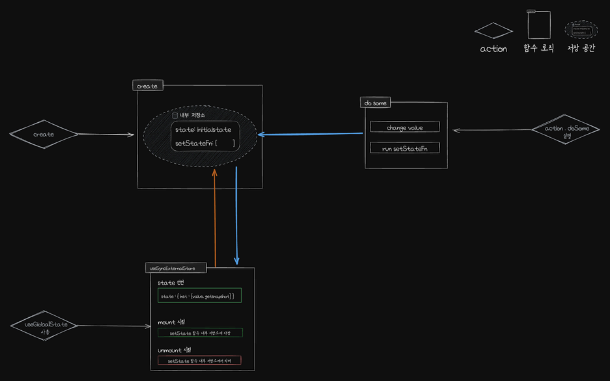

# useGlobalState (Zustand 원리 간단 이해)

---

- [useGlobalState (Zustand 원리 간단 이해)](#useglobalstate-zustand-원리-간단-이해)
  - [데모 페이지](#데모-페이지)
  - [만들게 된 계기](#만들게-된-계기)
  - [아키텍처](#아키텍처)
    - [전체 로직](#전체-로직)
  - [사용법](#사용법)
  - [의문점](#의문점)
    - [Zustand 코드 뜯어보기](#zustand-코드-뜯어보기)
  - [결론](#결론)

---

## 데모 페이지

https://quanjinlian.github.io/simple-components-demo/#/useGlobalState

---

## 만들게 된 계기

- 사내 라이브러리에 들어갈 Hooks 를 개발하는 과정에 전역 상태 관리 라이브러리가 필요하였다.
- 현재 이 라이브러리를 설치해서 쓰는 프로젝트들은 일단 Redux-toolkit 을 사용을 하고 있는 상황
- 하여 해당 Hooks 개발 시 Redux-toolkit 을 사용한다고 가정하고 개발한다면
  - 나중에 이 Hooks 를 가져다 쓸 프로젝트는 전역 상태 관리 라이브러리를 사용 안할 수도 있는데 해당 Hooks 때문에 어쩔수 없이 Redux-toolkit 설치를 해야 한다.
  - 만약 다른 전역 상태 관리 라이브러리 쓰고 싶은데(Recoil, Zustand, ....) 굳이 해당 Hooks 때문에 또 쓸데없이 Redux-toolkit 설치를 해야 한다.
- 하여 Redux-toolkit 을 포기하고 useContext 를 사용하게 된다면
  - 사용자가 해당 훅스 쓸려면 최상위 컴포넌트에 Provider 를 감싸줘야하는 수고스러움이 늘어 날 것이다.
  - 만약 까먹고 Provider 를 감싸지 않은 경우 또 제대로 동작 안하는 에러 상황이 발생할 수 있기에 않좋을 것 같다는 생각을 해 보았다.

그래서 뭐 기똥찬 방법이 없을까???
상태 관리 라이브러리 없이, useContext 사용하지 않고 할 수 있는 방법이 ??

## 아키텍처



### 전체 로직

GlobalStore Data Set

```ts
type GlobalStateItem<T> = {
  state: T;
  setStateFn: Set<Dispatch<SetStateAction<T>>>;
};

const _GlobalStore: Record<string, GlobalStateItem<any>> = {};
```

1. 컴포넌트 외부에서 `options`을 작성하여 `create` 함수 실행
   - `create` 함수 내부
     - [에러 던짐] `options` 이 값이 없는 경우 혹은 객체가 아닌 경우
     - [에러 던짐] `options.name` 이 값이 없는 경우 혹은 문자열이 아닌 경우
     - [에러 던짐] GlobalStore에 `options.name` 과 같은 key 가 이미 존재 한다면
     - [에러 던짐] `reducers` 가 값이 없는 경우 혹은 객체가 아닌 경우
     - [init & DB 저장] `GlobalStore[name]` 에 초기값 만들어서 저장 `{state : initialState, setStateFn: new Set()}`
     - [reducers 함수 가공] payload 값 을 파라미터로 넘겨 받으면 내부에서 `GlobalStore[name].state` 을 이용하여 데이터 조작을 맏기고 `GlobalStore[name].setStateFn` 반복하면서 조작 완료된 값을 바꿔주는 작업 등을 하는 함수로 가공하여 `actions` 라는 객체에 저장
     - [disconnect 함수 생성] `GlobalStore[name]` 의 값을 전체 삭제하는 로직이 있는 함수
     - [reconnect 함수 생성] `GlobalStore[name]` 의 값을 다시 init 하는 함수
     - [getInitialState 함수 생성] 초기값을 get 할 수 있는 함수
     - [useGlobalState 함수 생성] 해당 `options.name` 과 GlobalStore 을 기억하는 `useState`선언이 내재된 훅스 생성
   - `create` 함수 반환값
     - name : `options.name`
     - actions: `options.reducers` 를 가공한 새로운 함수들
     - getInitialState: 초기값을 get 할때 사용하는 함수
     - disconnect : 구독 취소 할때 사용하는 함수
     - reconnect : 구독 취소 했다가 다시 구독 할때 사용하는 함수
     - useGlobalState: 컴포넌트 내부에서 사용될 함수
2. 컴포넌트 내부에서 useGlobalState 함수 사용
3. GlobalState 변경 필요할때 actions['원하는 함수 명'] 실행
4. 구독 취소하면 actions 함수를 실행해도 state 값이 변경되지 않음
5. 구독 다시 연결하면 다음 actions 함수 실행 시 최신 값이 state에 반영 됨

## 사용법

```jsx
// import 생략

const countOb = create({
  name: 'count',
  initialState: 0,
  reducers: {
    plus: state => {
      return state + 1;
    },
    minus: state => {
      return state - 1;
    },
    reset: () => {
      return 0;
    },
  },
});

function GlobalStateBlockItem() {
  const count = countOb.useGlobalState();

  return (
    <div className="global-block">
      <p className="global-number">{count}</p>
      <div className="global-buttons">
        <button onClick={countOb.actions?.plus}>+</button>
        <button onClick={countOb.actions?.minus}>-</button>
        <button onClick={countOb.actions?.reset}>reset</button>
      </div>
    </div>
  );
}

const lengthArr = new Array(4).fill(0);

export function GlobalStateBlock() {
  return (
    <>
      <div className="global-page">
        {lengthArr.map((c, i) => (
          <GlobalStateBlockItem key={`${i}-${c}`} title={`${i + 1}st. Component `} />
        ))}
      </div>
      <GlobalStateBlockItem title="Global Button" hideNumber={true} />
    </>
  );
}
```

## 의문점

`useGlobalState` 호출 할때마다 `useState` 가 선언이 되는데 이게 과연 효율적일까?

### Zustand 코드 뜯어보기

https://github.com/pmndrs/zustand/blob/3c6dc2d12b0d2a2d5f403fe6ddad1053055ab72b/src/react.ts#L124

```ts
// 일단 entry 함수 create 부터 보자
// 옵션을 넘겨 줄때 createImpl(createState) 실행이 되나 보다
export const create = (<T>(createState: StateCreator<T, [], []> | undefined) =>
  createState ? createImpl(createState) : createImpl) as Create;

// createImpl 함수가 뭐지?
const createImpl = <T>(createState: StateCreator<T, [], []>) => {
  if (import.meta.env?.MODE !== 'production' && typeof createState !== 'function') {
    console.warn(
      "[DEPRECATED] Passing a vanilla store will be unsupported in a future version. Instead use `import { useStore } from 'zustand'`.",
    );
  }
  const api = typeof createState === 'function' ? createStore(createState) : createState;

  const useBoundStore: any = (selector?: any, equalityFn?: any) => useStore(api, selector, equalityFn);

  Object.assign(useBoundStore, api);

  return useBoundStore;
};

// 여기서 중요한거 저 useStore 것 같다, 저기서 반응형 store 가 생성되나 보다.
// 그래서 요것도 뭔가 보면

export function useStore<TState, StateSlice>(
  api: WithReact<StoreApi<TState>>,
  selector: (state: TState) => StateSlice = identity as any,
  equalityFn?: (a: StateSlice, b: StateSlice) => boolean,
) {
  if (import.meta.env?.MODE !== 'production' && equalityFn && !didWarnAboutEqualityFn) {
    console.warn(
      "[DEPRECATED] Use `createWithEqualityFn` instead of `create` or use `useStoreWithEqualityFn` instead of `useStore`. They can be imported from 'zustand/traditional'. https://github.com/pmndrs/zustand/discussions/1937",
    );
    didWarnAboutEqualityFn = true;
  }
  const slice = useSyncExternalStoreWithSelector(
    api.subscribe,
    api.getState,
    api.getServerState || api.getInitialState,
    selector,
    equalityFn,
  );
  useDebugValue(slice);
  return slice;
}
```

위의 코드들을 보면 최종 상태 관리 store 는 `useSyncExternalStoreWithSelector` 이 메소드로 만들어진 듯 싶었다.
해당 메소드를 찾아보니 React 에서 제공하는 것이였다.
그래서 `useSyncExternalStoreWithSelector` [소스 코드](https://github.com/facebook/react/blob/main/packages/use-sync-external-store/src/useSyncExternalStoreWithSelector.js)를 뜯어보면 내부에서는 또 `useSyncExternalStore` 메소드를 사용한다

[# useSyncExternalStore 사용법](https://react.dev/reference/react/useSyncExternalStore)
[useSyncExternalStore 내부 코드](https://github.com/facebook/react/blob/main/packages/use-sync-external-store/src/useSyncExternalStoreShimClient.js)

```js
// ... 생략

// 내부에서 useState 선언
const [{ inst }, forceUpdate] = useState({ inst: { value, getSnapshot } });

useEffect(() => {
  // setState 를 랩핑하는 handleStoreChange 함수 생성
  const handleStoreChange = () => {
    if (checkIfSnapshotChanged(inst)) {
      forceUpdate({ inst });
    }
  };
  // Subscribe to the store and return a clean-up function.
  return subscribe(handleStoreChange);
}, [subscribe]);
// ... 생략
```

해당 코드에 대한 이해

- useSyncExternalStore 함수 실행할때마다 내부적으로 useState를 한번 선언
- 해당 setState 함수를 외부 listeners 배열에 추가하게 subscribe 함수에 넘겨줌
- 값이 변경 시 listeners 내부에 담긴 setState 들을 전부 실행함
- 이로써 useSyncExternalStore 선언 후 사용하는 모든 state 값들이 통일되는 로직으로 돌아가는 것 같음

## 결론

내가 만든 `useGlobalState` 도 `useSyncExternalStore`와 같이 한번 실행할때 마다 useState 한번 선언 후 해당 setState 함수들을 한곳에 모은후 데이터 변경 시 해당 함수들을 전부 한번씩 실행함으로써 useContext 및 기타 전역 상태 관리 라이브러리 없이 반응형 데이터 생성이 가능하게 설계 되었다...

우와 뿌듯~~~
